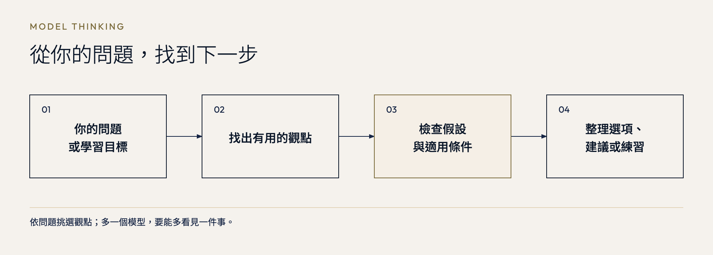
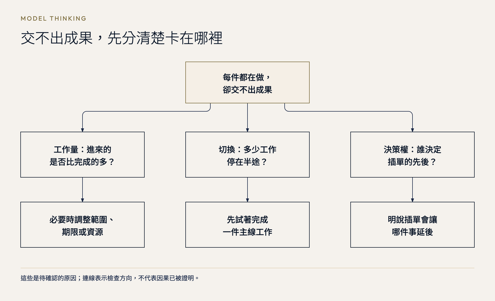

# Model Thinking

### 同一個問題，多幾種看法。

拿到新工作的 offer，要不要走？團隊遇到瓶頸，除了加人還能做什麼？Model Thinking 幫你把問題攤開，找出容易漏掉的選項，再看哪些資訊會改變決定。

你可以請它直接分析，也可以指定一個 mental model，或拿自己的情境來學。

[MIT](LICENSE) · 繁中手冊，回答跟隨你的語言

[安裝](#install) · [開始使用](#first-use) · [使用範例](#examples) · [十大領域](#domains) · [English](#english)

<a id="install"></a>
## 安裝

先選你使用的介面，不需要自己打包檔案。

| 你使用的介面 | 安裝入口 |
|---|---|
| Claude 網頁版／Desktop | [下載 skill ZIP](https://github.com/kcchien/model-thinking/releases/latest/download/model-thinking-claude-skill.zip) → **Customize → Skills → + → Create skill → Upload a skill** → 啟用。不用解壓縮；[找不到選單？](INSTALL.md#claude) |
| Codex／ChatGPT desktop 的本機工作模式 | [下載 OpenAI plugin ZIP](https://github.com/kcchien/model-thinking/releases/latest/download/model-thinking-openai-plugin.zip)，依[桌面安裝步驟](INSTALL.md#openai-desktop)加入本機市集 |
| ChatGPT 網頁版 | [查看工作區上傳與 Plugins Directory 的適用條件](INSTALL.md#openai-web)；不要把 ZIP 當一般聊天附件上傳 |

Claude Code、Codex CLI、Cursor 等開發工具，以下兩種 Skills CLI 安裝方式擇一即可。

### 交給 AI agent 安裝

將這段完整貼給你使用的 agent：

```text
請用 Skills CLI 從 https://github.com/kcchien/model-thinking 安裝 model-thinking，並確認安裝結果。
```

### 自行在終端機安裝

需要 [Node.js](https://nodejs.org/en/download) 與 [Git](https://git-scm.com/downloads)。在你要使用 skill 的專案目錄開啟終端機，執行：

```sh
npx skills@latest add https://github.com/kcchien/model-thinking
```

依提示選擇你的 agent 與安裝範圍：只用在這個專案選 **Project**；希望其他專案也能使用則選 **Global**。其他選項見 [Skills CLI 安裝說明](https://github.com/vercel-labs/skills#install-a-skill)。

### Codex 桌面版：貼上這段即可開始安裝

在可存取本機檔案的 Codex／ChatGPT Work 對話貼上：

```text
請下載 https://github.com/kcchien/model-thinking/releases/latest/download/model-thinking-openai-plugin.zip，檢查並解壓縮，用 plugin-creator 加入我的本機 plugin 市集，保留其他項目，完成安裝並確認結果；不要發布或分享。
```

完成後重新啟動桌面 app，在 Plugins Directory 選取本機市集並確認已啟用，再開新對話。[詳細步驟與適用條件](INSTALL.md#openai-desktop)。這不是網頁版的 ZIP 上傳指令；網頁版入口見 [安裝說明](INSTALL.md#openai-web)。

<a id="first-use"></a>
## 安裝後，試第一個問題

在剛才選擇的 agent 開啟新對話，貼上：

```text
請用 model-thinking 分析這個問題：
六件工作同時進行，三個群組不斷插單，每個人都說急。我試過待辦清單和番茄鐘，還是每件做一點、沒有一件交得出去。
除了讓自己更專注，還有哪些可能原因？我可以先確認什麼？
```

之後把情境換成你自己的問題即可。若 agent 找不到 skill，先確認安裝時選的是同一個 agent；若選了 Project，也要在同一個專案開啟對話。仍有問題可[回報安裝問題](https://github.com/kcchien/model-thinking/issues/new)。

## 為什麼做這個工具

很多時候，我們還沒想清楚有哪些選擇，就開始比較眼前的兩個答案。Model Thinking 想讓這一步慢一點：先換幾個角度看，再決定要往哪裡走。

這個想法受到 Charlie Munger（查理・芒格）的啟發。他在《Poor Charlie’s Almanack》談到 latticework of mental models：把不同學科的觀念連起來，幫助理解經驗與判斷問題。同一件事，從誘因、心理或系統回饋來看，可能會發現不同的線索。[出版者介紹](https://press.stripe.com/poor-charlies-almanack)

Scott E. Page 的《The Model Thinker》則提出 many-model paradigm，運用數學、統計與計算模型理解資料和複雜現象。本工具借用其中比較不同模型的思路。這些形式模型與一般的思考口訣並不相同，所以手冊會分清楚：哪些有明確定義與假設，哪些來自研究，哪些只是幫助發想的啟發法。[出版者介紹](https://www.hachettebookgroup.com/titles/scott-e-page/the-model-thinker/9780465094639/)

做成 skill，是希望這些觀念能在需要時派上用場。每次只挑與問題有關的工具，說清楚它補上了什麼、在哪些條件下才適用。你也能打開 [SKILL.md](SKILL.md)，查看或修改 AI 使用的指引。

這是獨立整理的工具，與上述作者、書籍及出版者沒有合作或背書關係。

## 三種用法

| 你想做什麼 | 怎麼開口 |
|---|---|
| 把眼前的問題想清楚 | 描述情境、限制與你正在考慮的選項，不必先知道模型名稱 |
| 用熟悉的模型檢查計畫 | 指定「請用 Pre-Mortem」，再貼上計畫；若不適用，回答會指出原因 |
| 把一個觀念學會 | 指定概念與生活情境，請它解釋、舉例，再出一道練習 |



先從你的問題找工具，只讀相關參考。多一個模型要能多看見一件事；沒有幫助就不加。想探索時保留不同解釋，想決定時才整理取捨與下一步。

## 可以拿來做什麼

| 遇到的問題 | 可以怎麼用 |
|---|---|
| 選項只剩「做或不做」 | 找出其他可行選擇，把各自的代價一起算進來 |
| 大家都認為原因只有一個 | 提出其他解釋，列出哪些觀察能分辨它們 |
| 讀過模型，卻不知道怎麼套用 | 用你的情境說明概念、假設與容易誤用的地方 |

<a id="examples"></a>
## 用在自己的問題上

以下是實際執行的示範，情境與數字都是設定，引用保留回答原文。先看你正在遇到的問題；[完整提問與回答](EXAMPLES.md)都可以直接複製。

### 工作插單：收到急件，不必立刻切換工作

六件工作同時進行，三個群組不斷插單。待辦清單和番茄鐘都試過了，還是每件做一點、沒有一件交得出去。

回答把「我不夠專注」拆成三種可能原因。工作量超過能力，要調整承諾；切換太多，要減少同時開工；沒有人排先後，要讓有權決定的人確認代價。



可以直接帶回群組的是這句：

> 「我目前正在做 A，預計＿＿交付。若現在改做這件，A 預計會順延＿＿。請主管確認是否替換。」

**多看見的一步：**「回覆收到」和「現在開工」可以分開。限制同時開工也不能補上不足的產能；若卡在等審核，還要處理等待的環節。

[複製提問、查看插單規則與兩週做法](EXAMPLES.md#mt-overload)

### 轉職 offer：加薪兩成，會不會只是換地方救火？

現職月薪七萬元，每週加班八小時，年底可能有未保證的二十萬元獎金。新公司開八萬四千元、說可以帶產品，卻還沒講清楚決策權與人力。週五前要答覆；一年半後，你也可能需要搬家。

只比較薪資，容易把「帶新產品」當成已經拿到的機會。回答先確認你真正想換到的是什麼，再把兩個選項拆開：

| 可以談的選項 | 要確認的具體安排 |
|---|---|
| 現職調整工作 | 哪些救火工作交出去、誰承接、何時開始有產品時間 |
| 新職釐清承諾 | 前三個月做什麼、何時轉入產品、資源未到位時怎麼辦 |
| 留職繼續找 | 如何先處理救火負擔，避免「繼續找」只是延長原狀 |

到了期限仍問不到關鍵資訊，回答給了一個可用來做決定的問題：

> **即使「帶新產品」暫時不成立，我是否仍願意接受這份工作的已知條件？**

**多看見的一步：**薪資比較、必要條件與撤回成本回答的是不同問題。加薪不能替你確認產品責任；搬家的可能性也不必立刻變成否決條件，可以先查兩邊的遠距安排。

週五前先把三件事問清楚，並將回答標成「已確認／口頭意向／未知」：

- 問新主管：前三個月究竟做什麼，何時、由誰決定轉入產品工作？
- 問現任主管：若要留出產品時間，哪些救火工作交出去，誰承接、何時開始？
- 問自己：若關鍵承諾仍未確認，是否願意只憑已知條件做這個選擇？

[複製完整情境與兩邊主管的提問清單](EXAMPLES.md#mt-offer)

### 每週讀一本書，開會時卻想不起來怎麼用

讀商業書時覺得很有道理，討論定價、招人或專案延期時卻腦袋空白。朋友建議一年只精讀三本，你又怕視野變窄。每週只有三小時，該怎麼安排？

回答沒有急著選讀深或讀廣，而是先分辨：想不起來、理解不清、缺資料，還是不敢在會議中開口？這幾種情況，需要的做法不同。

> **現場不必說出模型名稱，能提出有用問題才是重點。**

下一場會議就能試：會前五分鐘，先不看筆記，寫下要決定什麼、自己的暫定判斷，以及哪項資訊會讓自己改變看法。寫完再查筆記，會中可以帶著看。會後記下何時想到、卡在哪裡，再決定要補什麼：

| 實際卡住的地方 | 接下來怎麼調整 |
|---|---|
| 想得到，但說不清適用條件 | 精讀相關章節，找一個不適用的例子 |
| 事後才想到 | 練習不看筆記提取，再核對更正；會前先準備 |
| 想得到，也懂，但缺公司資料 | 補資料或問對人，不急著再讀一本 |
| 準備時可以，開會時說不出來 | 試著事先書面分享，或安排固定發言時點 |

先做一張決策卡，不用重整整個筆記系統。卡片要寫「遇到什麼情境、先問什麼、何時不適用、還需要什麼資料」。一個月先看能否更早提出有用問題；定價與招募的結果，可能還需要時間才能知道。

[複製提問、決策卡與每週三小時安排](EXAMPLES.md#mt-learning-transfer)

<details>
<summary>指定 Pre-Mortem：付款測過了，訂閱就能上線嗎？</summary>

四人團隊兩週後要推出付費會員，還得維護原本的課程。付款流程測過，但取消、退款、扣款失敗與客服尚未完整演練。

用 Pre-Mortem 假設上線一個月後出了問題，回答把失敗原因整理成推出方式的判斷：

| 演練結果 | 推出方式 |
|---|---|
| 關鍵流程與客服交接能完成，異常能被發現及補救 | 可以推出；宣傳節奏仍依處理能力安排 |
| 流程正確，但人工工時與客服負荷不明 | 分批邀請，先看處理工時與積壓 |
| 不能可靠停止續扣、退款或追查異常 | 延後收費上線 |

最有用的驗收動作是：

> **最值得先做的一件事：明天就讓備援同事扮演會員，完整走一次「取消＋退款」。**

倒推過程是：如果會員取消後仍被扣款，哪一步可能斷掉？回答把取消生效日、金流通知、權限與客服交接一起放進演練。

**多看見的一步：**「有人知道怎麼做」和「備援照文件也做得完」不同；停止招募新會員，也不會讓既有會員權益消失。是否如期上線，因而變成能檢查的條件。

[複製 Pre-Mortem 提問與完整演練清單](EXAMPLES.md#mt-premortem)

</details>

<details>
<summary>個人成長：英文課買了三門，開會還是不敢說</summary>

三個月後要用英文報告五分鐘進度，每週只有三個晚上、各四十分鐘。已買的課都沒上完，還要再買一門嗎？

> **先不要買新課，也不必把舊課全部上完。這週先用現有材料，練一次真實的進度報告，再看缺的是教材、口說練習，還是回饋。**你的目標是三個月後能報告與應答，不是完成課程。

沉沒成本幫你放下「買了就得上完」；提取練習則把注意力轉向能否真的說出來。第一晚先錄音找三個卡點，第二晚只看提綱重講，第三晚加入五題問答。留下的是錄音、提綱和簡答；若仍缺工作情境或具體回饋，再據此挑課。

[複製提問、三晚安排與英文報告骨架](EXAMPLES.md#mt-english)

</details>

<details>
<summary>學一個觀念：湊免運，怎麼用二階思考？</summary>

800 元商品加 80 元運費是 880 元；多買 200 元湊免運，付款變成 1,000 元。這些是假設數字：眼前多付 120 元，還不能直接決定划不划算。

> **關鍵區別：**第一階看「這次多付多少、得到什麼」；第二階看「它會取代哪些未來支出、帶來哪些負擔，以及改變什麼行為」。不是單純把優點叫第一階、缺點叫第二階。

接著看加買的東西是否取代下週採買、會不會過期，以及是否養成為了免運而加買的習慣。完整示範最後有一題咖啡豆練習，沒有先公布答案，方便自己試著用一次。

[複製教學提問、查看說明與練習](EXAMPLES.md#mt-second-order)

</details>

<a id="domains"></a>
## 十大領域，按問題取用

你不必先讀完手冊。想找特定概念、查看適用條件，或自己修改內容，可以從這裡進去。

| 領域 | 常用來想什麼 | 代表概念 |
|---|---|---|
| [決策](references/decisions.md) | 選擇、可逆性與取捨 | 機會成本、二階思考、Pre-Mortem |
| [系統](references/systems.md) | 反覆發生的問題與回饋 | 存量與流量、延遲、成長限制 |
| [統計](references/statistics.md) | 機率、資料與預測 | 基本率、選擇偏差、相關與因果 |
| [策略](references/strategy.md) | 競爭、合作與談判 | 賽局、BATNA、先行與跟隨 |
| [心理](references/psychology.md) | 判斷偏誤與人際解釋 | 確認偏誤、損失趨避、歸因 |
| [網路](references/networks.md) | 連結、傳播與平台 | 弱連結、網路效應、擴散 |
| [演算法](references/algorithms.md) | 搜尋、排程與有限資源 | 探索與利用、優先順序、切換成本 |
| [風險](references/risk.md) | 不確定性與損失承受能力 | 安全邊際、可逆性、曝險 |
| [學習](references/learning.md) | 練習、記憶與知識遷移 | 提取練習、間隔學習、刻意練習 |
| [經濟](references/economics.md) | 資源配置、市場與誘因 | 邊際思考、比較優勢、外部性 |

需要把不同觀點放在一起時，可看 [組合示例](references/combinations.md)。各條目會區分正式模型、實證發現與啟發法，並說明適用條件。

## 回報問題或參與修改

如果某句推論不成立，或你找到更好的用法，歡迎[回報問題或建議](https://github.com/kcchien/model-thinking/issues/new)。請附上去除私人資訊後的提問、原始回答，以及你認為需要修正的地方。內容修正也歡迎附上一級來源；細節見 [參與修改](CONTRIBUTING.md)。

<a id="english"></a>
## English

**More ways to see.**

Inspired by Charlie Munger’s latticework of mental models and Scott E. Page’s many-model thinking, this independent adaptation turns concepts into prompts for alternative explanations, explicit assumptions, and useful next steps. It is not affiliated with or endorsed by the original authors.

Model Thinking helps develop alternative explanations, options, and cross-domain analogies, then identifies the conditions under which each insight holds. Use it for direct analysis, applying a named mental model, or learning one. Responses follow the user's language.

**Install with your agent** — paste this entire prompt:

Using Claude web/Desktop or OpenAI desktop/web instead? See the [platform-specific installation guide](INSTALL.md#english). The Skills CLI instructions below are for coding agents with terminal access.

```text
Use Skills CLI to install model-thinking from https://github.com/kcchien/model-thinking and verify the installation.
```

**Install in a terminal** — requires [Node.js](https://nodejs.org/en/download) and [Git](https://git-scm.com/downloads). Run this in your project directory:

```sh
npx skills@latest add https://github.com/kcchien/model-thinking
```

Select your agent, then choose **Project** for this project only or **Global** to use it across projects. See the [Skills CLI installation guide](https://github.com/vercel-labs/skills#install-a-skill) for other options.

**Try it** — start a new conversation in the selected agent and paste:

```text
Use model-thinking to analyze this problem: I have six tasks in progress, and three group chats keep sending urgent requests. To-do lists and Pomodoro sessions have not helped me finish. What other causes should I consider, and what should I check first?
```

If the skill is not found, check that you selected the same agent and, for a Project installation, opened the same project. [Report an installation problem](https://github.com/kcchien/model-thinking/issues/new) if it persists.

## 授權 / License

[MIT](LICENSE)。保留既有著作權聲明；連結文獻的著作權由各原作者持有。
